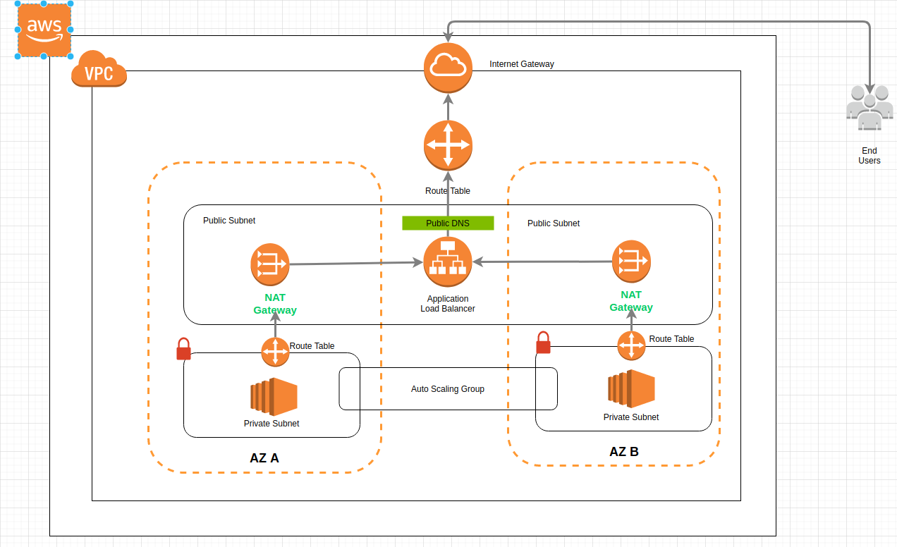

# terraform-vpc-module
This module deploys a basic Web application on AWS. Following resources will be deployed if the values from terraform.tfvars are used

    1. VPC
    2. Internet Gateway
    3. 2 Public Subnets
    4. 2 Private Subnets
    5. Public Security Group
    6. Private Security Group
    7. 2 NAT Gateways
    8. Application Load Balancer
    9. Listner 
    10. Tagret Group
    11. Launch Configuration
    12. Auto Scaling Group

## Prequisites
    *   Terraform12
    *   Logged in to AWS Cli
    *   Environment Variables 
Details can be found [here](https://registry.terraform.io/providers/hashicorp/aws/latest/docs)
You can provide your credentials via the AWS_ACCESS_KEY_ID and AWS_SECRET_ACCESS_KEY, environment variables, representing your AWS Access Key and AWS Secret Key, respectively. Note that setting your AWS credentials using either these (or legacy) environment variables will override the use of AWS_SHARED_CREDENTIALS_FILE and AWS_PROFILE. The AWS_DEFAULT_REGION and AWS_SESSION_TOKEN environment variables are also used, if applicable:


## Deploy
```
terraform init
terraform workspace new mhdemo-us-east-1-dev
terraform workspace select mhdemo-us-east-1-dev
terraform plan
terraform apply
```
```diff
- Note: After deployment, wait till the Target Groups's Health Checks passes!
```

## Architecture (High Availability / Multi A-Z)

